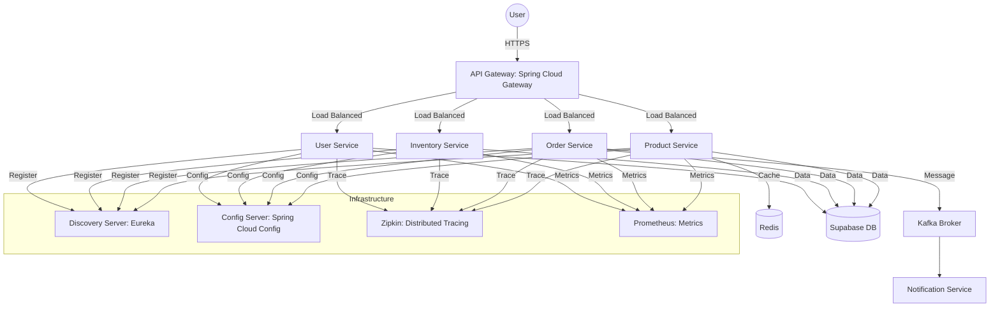

# 🛒 STARK_MARKET: Next-Gen Microservices Platform


## 🌟 Overview

**STARK_MARKET** is a state-of-the-art E-Commerce Microservices Platform engineered for scalability, resilience, and high performance. Inspired by Stark Industries' R&D, this project demonstrates a modern cloud-native architecture using Spring Boot, Docker, and Supabase.

> [!IMPORTANT]
> This project is designed as a template for professional-grade microservices development, featuring distributed tracing, centralized configuration, and a premium "Stark" themed frontend.

---

## 🏗️ Architecture



---

## 🚀 Key Features

### 🛡️ Core Infrastructure
- **Service Discovery**: Netflix Eureka for dynamic service registration and health monitoring.
- **API Gateway**: Unified entry point with rate limiting, load balancing, and global logging.
- **Centralized Config**: Externalized configuration management via Spring Cloud Config.
- **Distributed Tracing**: Full request visibility with Spring Cloud Sleuth and Zipkin.

### 💼 Business Services
- **Product Catalog**: High-performance inventory management with Redis caching.
- **Order System**: Reliable transaction processing with Resilience4j circuit breakers.
- **Notification Engine**: Event-driven architecture using Kafka for asynchronous messaging.
- **User Management**: Secure authentication integrated with Supabase Auth.

### 💎 Premium Frontend
- **Stark Theme**: A high-tech, neon cyan UI built with React & Vite.
- **Glassmorphism**: Modern UI design with backdrop filters and glowing accents.
- **Responsive**: Fully optimized for mobile and desktop experiences.

---

## 🛠️ Tech Stack

- **Backend**: Java 17, Spring Boot 2.7, Spring Cloud
- **Frontend**: React, Vite, Lucide Icons, Axios
- **Database**: PostgreSQL (Supabase), Redis
- **Messaging**: Apache Kafka
- **Observability**: Prometheus, Grafana, Zipkin, Sleuth
- **DevOps**: Docker, Docker Compose, Kubernetes (K8s)

---

## 🚦 Getting Started

### Prerequisites
- [Docker & Docker Compose](https://www.docker.com/)
- [Java 17+](https://adoptium.net/)
- [Node.js & npm](https://nodejs.org/)

### 1. Build the Microservices
```bash
mvn clean install -DskipTests
```

### 2. Launch Infrastructure & Services
```bash
docker-compose up -d
```

### 3. Spin up the Frontend
```bash
cd frontend
npm install
npm run dev
```

---

## 📍 Service Registry

| Service | Port | Description |
| :--- | :--- | :--- |
| **Discovery Server** | `8761` | Eureka Dashboard |
| **API Gateway** | `8080` | Entry point & Swagger Aggregator |
| **Config Server** | `8888` | Property Management |
| **Zipkin** | `9411` | Distributed Tracing UI |
| **Prometheus** | `9090` | Metrics Collection |
| **Grafana** | `3000` | Analytics Dashboards |

---

## 📖 API Documentation

Access the **Unified Swagger UI** at:
`http://localhost:8080/swagger-ui.html`

This portal aggregates documentation from all running microservices into a single, interactive dashboard.

---

## 🤝 Contributing

1. Fork the Project
2. Create your Feature Branch (`git checkout -b feature/AmazingFeature`)
3. Commit your Changes (`git commit -m 'Add some AmazingFeature'`)
4. Push to the Branch (`git push origin feature/AmazingFeature`)
5. Open a Pull Request

---

*Built with ❤️ for the Developer Community by Antigravity AI.*
